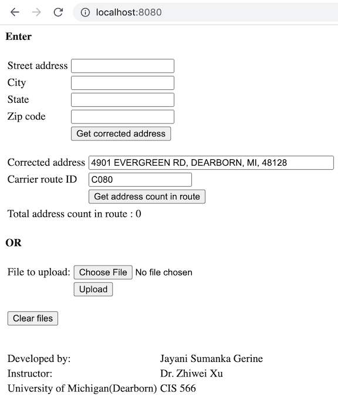

#### Steps to run the project
 - If not already present, create a folder `upload-dir` at same level as `src`. This is the folder where uploaded files as well as generated reports will be stored.
 - To run the project, use the command `mvn spring-boot:run`. This will start the web-application on the port `8080`
 - `http://localhost:8080` in any browser will take you the home page of the application.
#### Sequence diagram
 
#### Description
 - The project is implemented by using there different design patterns: Façade design pattern, Builder design pattern and Dependency Injection design pattern. I have used spring MVC Framework to implement this project as a web application.
##### Façade: Class Diagram
  
 - When user uploads a file, it must undergo various processing like storage, parsing, Rest API calls and so on. All these steps are encapsulated in the ProcessUploadFacade class. ProcessUploadFacade constructor initializes all the above services and makes it available to be used. The upload controller does not need to worry about how the file will be processed as it only needs access to processFileUpload method of ProcessUploadFacade.
##### Builder: Class Diagram
 
 - There are two types of reports that will be generated. Report1 provides the list of corrected address and carrier route id. Report2 provides the number of addresses in the carrier route id obtained in Report1. Both are .csv file reports. Hence, I have used builder pattern to generate these reports.
##### Dependency Injection: Class Diagram
 
 - I have used Spring Framework and Dependency Injection Design Pattern for object creation. This enables inversion of control so that object lifecycle is efficiently managed by the spring container. To achieve this, I had to annotate services and config classes so that container creates their instances and there is no need to use the new keyword to create object instances. The spring container will inject those objects via @Autowire as and when needed.
 
##### Walkthrough 
 
 - You have option to enter one address and get its corrected address, carrier route and number of addresses in that carrier route or upload a batch of addresses in `.csv` file. When you upload a `.csv` file, it generates 2 reports which can be downloaded. 
 - Lets try the first option. We will enter the address `4901 Evergreeen Rd, Dearbornn, mi, 48128`. Please note the spelling mistakes in address. When you hit `Get corrected address` button, it returns corrected address and its corresponding carrier route id.
    
 - Now click the `Get address count in route` button. It returns total address count in that route. This result count matches the `Mellisa data` record, hence we can be sure that it is working accurately.
    
    
   

 - Lets try another address
   

 - Lets try to upoad a input csv file
   
 - Uploaded file will be parsed, calls will be made to USPS APIs and following 2 reports will be generated, which can be downloaded.
 
   
    
 - Lets look at the reports generated
   
   

 